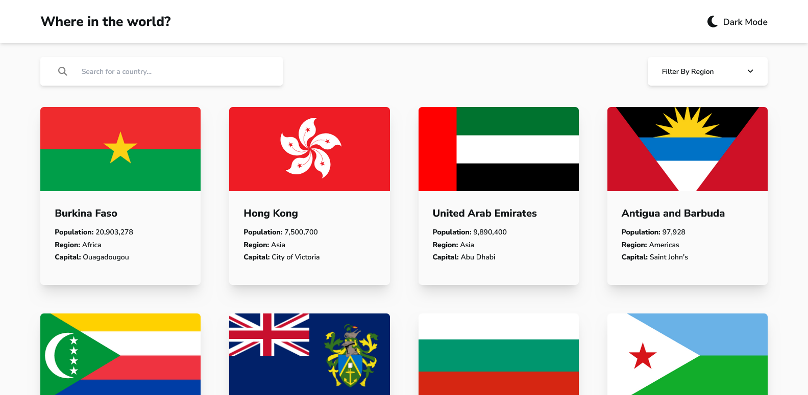

# Frontend Mentor - REST Countries API with color theme switcher solution

This is a solution to the [REST Countries API with color theme switcher challenge on Frontend Mentor](https://www.frontendmentor.io/challenges/rest-countries-api-with-color-theme-switcher-5cacc469fec04111f7b848ca). Frontend Mentor challenges help you improve your coding skills by building realistic projects. 

## Table of contents

- [Overview](#overview)
  - [The challenge](#the-challenge)
  - [Screenshot](#screenshot)
  - [Links](#links)
- [My process](#my-process)
  - [Built with](#built-with)
  - [What I learned](#what-i-learned)
  - [Continued development](#continued-development)
- [Author](#author)

## Overview

### The challenge

Users should be able to:

- See all countries from the API on the homepage
- Search for a country using an `input` field
- Filter countries by region
- Click on a country to see more detailed information on a separate page
- Click through to the border countries on the detail page
- Toggle the color scheme between light and dark mode *(optional)*

### Screenshot



### Links

- Solution URL: [https://github.com/Ihezie/rest-countries-api-with-color-theme-switcher.git](https://github.com/Ihezie/rest-countries-api-with-color-theme-switcher.git)
- Live Site URL: [https://extraordinary-bubblegum-372d49.netlify.app/](https://extraordinary-bubblegum-372d49.netlify.app/)

## My process

### Built with

- Semantic HTML5 markup
- CSS custom properties
- Flexbox
- CSS Grid
- Mobile-first workflow
- [React](https://reactjs.org/) - JS library
- [tailwindCSS](https://tailwindcss.com/) - CSS library
- [ReactRouter](https://reactrouter.com/en/main) - JS library Routing Library
- [axios](https://axios-http.com/) - For Http Requests

### What I learned
I learned and improved on a boatload of things while completing this project. Including but not limited to working with APIs, routing with the react router library, filtering data gotten from an API, working with CSS grid layouts and using react hooks more efficiently. I pretty proud of the code snippet below.

```js
  useEffect(() => {
    if (!loading) {
      const filteredData = data.filter((country) => {
        let inRegion = false;
        let matchesSearch = false;
        if (region === "none") {
          inRegion = true;
        } else {
          inRegion = country.region.toLowerCase() === region;
        }
        if (searchParam === "") {
          matchesSearch = true;
        } else {
          matchesSearch = country.name.common
            .toLowerCase()
            .includes(searchParam.toLowerCase());
        }
        return inRegion && matchesSearch;
      });
      setLocalData(filteredData.length === 0 ? "no match" : filteredData);
    }
  }, [loading, region, searchParam]);
```
### Continued development
In future projects, I plan to become more proficient at consuming APIs. Also I plan to learn how to implement better user friendly animations in my websites.

## Author
- Frontend Mentor - [@Ihezie](https://www.frontendmentor.io/profile/Ihezie)

